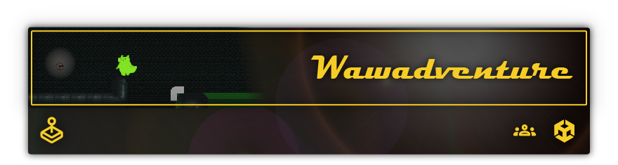
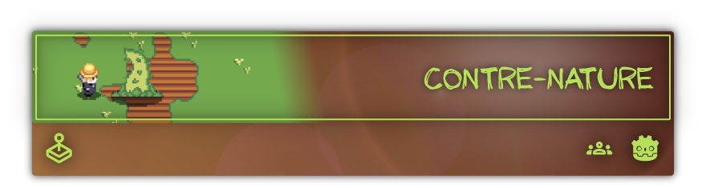

# Colin Vaufrey, créateur de jeux vidéo et _serious games_.

## Voici quelques-uns de mes projets les plus marquants !

Dans ce **jeu de plateforme 2D**, vous incarnez **Wawa**, qui cherche à sortir des égouts dans lesquels il est perdu. Pour ce faire, il peut utiliser ses **wawabilities** pour déplacer des blocs de diverses manières afin de récupérer la **vanne** qui lui permettra de s’échapper.

**Wawadventure** est un projet **scolaire** réalisé en **groupe de 7** dans le cadre de mon **master AMINJ**.

| **Résumé** | _**Jeu de plateforme 2D** avec **mécanique de déplacement de blocs**._ |
|-|-|
| **Mon rôle** | _**Game designer** et **développeur**._ |
| **Technologies** | _**Unity** et **C#**._ |
| **Éléments importants** | — _**Tilemap et modification de tilemap** ; — **Mécaniques de déplacement de blocs (translations, rotations, switch)** ; — **Parkour 2D avec astuces pour la précision**._ |

Vous vous réveillez dans un **monde mystérieux** et **nostalgique**, où vous devrez explorer des **donjons générés aléatoirement** pour **trouver des composants de PC** et les assembler pour vous échapper. Attention aux **statues** cherchant à vous éliminer !

**ＶａｐｏｒＤｕｎｇｅｏｎ** est un projet **scolaire** réalisé entièrement par moi-même dans le cadre de mon **master AMINJ**.

| **Résumé** | _**Jeu d’exploration 3D** avec **génération procédurale de donjons**._ |
|-|-|
| **Mon rôle** | _**Création complète du jeu**._ |
| **Technologies** | _**Unity** et **C#**._ |
| **Éléments importants** | — _**Génération procédurale de donjons (Wave Function Collapse)** ; — **Parkour en 3D avec astuces pour la précision** ; — **Shaders & ambiance rétro**._ |

De nombreux **patients** arrivent à l’hôpital ! Orientez-les vers les **services** adéquats et **occupez-vous d’eux** pour les **satisfaire**. Attention à ne pas trop les faire **attendre** ou les perdre en route !

**Welcome** est un _**serious game**_ portant sur les concepts de **flux** et de **files d’attente** dans le domaine des **sciences de l’information** dans le **domaine de la santé**. Mon équipe de 3 personnes l’a hérité d’un groupe précédent et l’a **amélioré**. Il sert actuellement dans les cours d’**ISIS** à l’**INU Champollion**.

| **Résumé** | _**Serious game** sur les **flux** et les **files d’attente** dans le **domaine de la santé**._ |
|-|-|
| **Mon rôle** | _**Game designer** et **développeur**._ |
| **Technologies** | _**Unity** et **C#**._ |
| **Éléments importants** | — _**Reprise d’un projet existant** ; — **Amélioration de l’interface** ; — **Meilleure distribution du logiciel (format web)** ; — **Mini-jeu en plus (jeu de timing)**._ |

**Alg’audition** permet aux professionnels de santé de **tester** et **améliorer** leur **connaissance** de l’algorithmique de décision du projet ICOPE Audition. Il met les joueurs dans la peau d’un **médecin** devant **diagnostiquer** et **rediriger** des patients vers des **spécialistes**. En traitant les patients, le joueur **gagne de la monnaie** qu’il peut **dépenser** pour **décorer** sa **salle d’attente** !

**Alg’audition** est un projet **scolaire** réalisé en **groupe de 5** dans le cadre de mon **master AMINJ** en partenariat avec le **gérontopôle** du **CHU de Toulouse**.

| **Résumé** | _**Serious game** sur l’**algorithmique de décision** du projet **ICOPE Audition**._ |
|-|-|
| **Mon rôle** | _**Chef de projet**, **game designer** et **développeur**._ |
| **Technologies** | _**Unity** et **C#**._ |
| **Éléments importants** | — _**Parcours sous forme d’arbre** ; — **Boutique** ; — **Décorations**._ |

Rejoignez le **Buzz Express** et démontrez l’étendue de votre **culture générale** dans ce **jeu de quiz multijoueur en ligne**. **Défiez** vos amis ou des **inconnus** et **répondez** à des **questions** de diverses **catégories** pour **gagner des points** et **grimper dans le classement** ! Arriverez-vous à **devenir le meilleur** ?

**Buzz Express** est un **projet personnel** qui me tient beaucoup à cœur et que je développe petit à petit depuis plusieurs années. Je développe en parallèle le **client** et le **serveur**. À ce jour, une version basique du jeu est **jouable en ligne**, et je m’efforce de rajouter de **nouvelles questions** ainsi que de **nouvelles fonctionnalités** régulièrement.

| **Résumé** | _**Jeu de quiz multijoueur en ligne**._ |
|-|-|
| **Mon rôle** | _**Création complète du jeu**, **administrateur serveur**._ |
| **Technologies** | Server : _**Node.js**, **TypeScript**, **SQLite**._ Client : _**Godot Engine**, **GDScript**._ Réseau : _**WebSocket**._ |
| **Éléments importants** | — _**Questions aléatoires** ; — **Connexion** et  **persistance des données** ; — **Jeu en ligne en temps réel**._ |

Jerry en a assez de sa vie mouvementée et décide de vivre à la **ferme**. Heureusement pour lui, il a **hérité** d’un terrain particulièrement **fertile**… peut-être même un peu trop ! Cultivez des **légumes** tout en défendant votre **ferme** contre des **invasions de plantes mutantes** !

**Contre-nature** est un **petit jeu sans prétention** réalisé en **une semaine** dans le cadre de la **Godot Wild Jam #36** avec deux amis qui m’ont aidé pour les **graphismes** et la **musique**.

| **Résumé** | _**Jeu de défense de ferme** avec **cultures de légumes**._ |
|-|-|
| **Mon rôle** | _**Game designer** et **développeur**._ |
| **Technologies** | _**Godot Engine** et **GDScript**._ |
| **Éléments importants** | — _**Terrain éditable** ; — **Cultivation de légumes** ; — **Ennemis visant les cultures** ; — **Musique adaptative**._ |

Dans ce **jeu d’esquive** de **patterns**, vous incarnez un **moaï** devant **éviter** des **piques** apparaissant sous vos pieds. **Survivez** le plus longtemps possible **seul** ou **face à vos amis**, en **local** ou en **ligne** !

**The Strafing Game Renewed** est un **projet personnel** basé sur divers prototypes du même nom que j’ai réalisés au fil des ans. Il est actuellement **jouable en ligne** mais **n’incorpore plus le multijoueur en ligne**.

| **Résumé** | _**Jeu d’esquive de patterns**._ |
|-|-|
| **Mon rôle** | _**Création complète du jeu**._ |
| **Technologies** | _**Godot Engine** et **GDScript**._ |
| **Éléments importants** | — _**Déplacements sur une grille** ; — **Patterns procéduraux** ; — **Multijoueur local et en ligne**._ |
