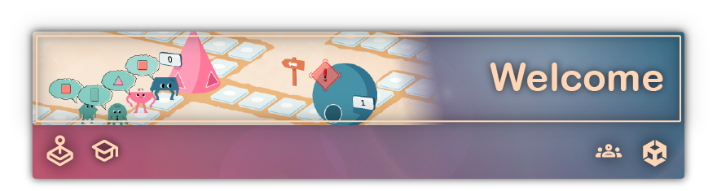
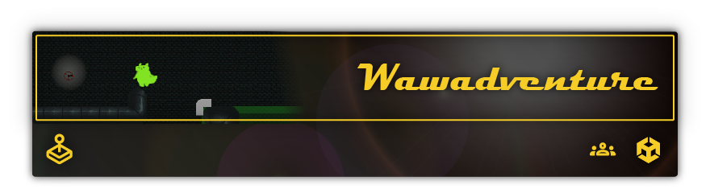
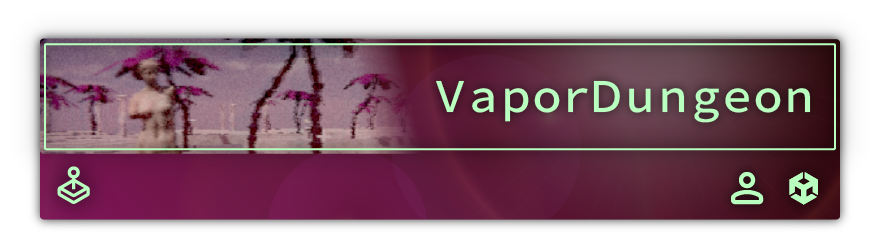
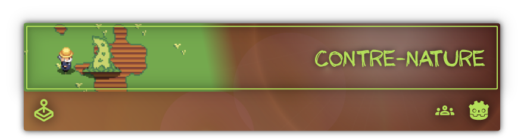
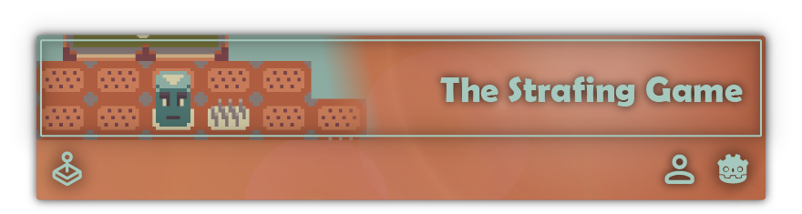

# Colin Vaufrey, video game creator and serious games developer.

## Here are some of my most notable projects!

[:fr: Français](./README.md) | **:uk: English**

- [:hospital: Welcome](#welcome)
- [:smiley_cat: Wawadventure](#wawadventure)
- [:ear: Alg’audition](#algaudition)
- [:palm_tree: ＶａｐｏｒＤｕｎｇｅｏｎ](#ｖａｐｏｒｄｕｎｇｅｏｎ)
- [:question: Buzz Express](#buzz-express)
- [:seedling: Contre-nature](#contre-nature)
- [🗿 The Strafing Game Renewed](#the-strafing-game-renewed)

## Welcome

Many **patients** are arriving at the hospital! Guide them to the appropriate **departments** and **take care of them** to ensure their **satisfaction**. Be careful not to keep them waiting too long or lose them along the way!

  

**Welcome** is a _**serious game**_ focusing on the concepts of **flow** and **queues** in the field of **information science** within the **healthcare domain**. My team of three inherited it from a previous group and has **improved** it. It is currently used in **ISIS** courses at **INU Champollion**.

| **Summary** | _**Serious game** about **flow** and **queues** in the **healthcare domain**._ |
|-|-|
| **My Role** | _**Game designer** and **developer**._ |
| **Technologies** | _**Unity** and **C#**._ |
| **Key Elements** | — _**Continuation of an existing project** ; — **User interface improvements** ; — **Better software distribution (web format)** ; — **Additional mini-game (timing game)**._ |

## Wawadventure

In this **2D platformer**, you play as **Wawa**, who is trying to escape from the sewers where he is lost. To do this, he can use his **wawabilities** to move blocks in various ways to retrieve the **valve** that will allow him to escape.

  

**Wawadventure** is a **school project** completed in a **group of seven** as part of my **AMINJ master's program**.

| **Summary** | _**2D platformer** with **block-moving mechanics**._ |
|-|-|
| **My Role** | _**Game designer** and **developer**._ |
| **Technologies** | _**Unity** and **C#**._ |
| **Key Elements** | — _**Tilemap and tilemap modification** ; — **Block-moving mechanics (translations, rotations, switches)** ; — **2D parkour with precision tricks**._ |

## Alg’audition

**Alg’audition** allows healthcare professionals to **test** and **improve** their **knowledge** of the decision-making algorithm of the ICOPE Audition project. It puts players in the role of a **doctor** who must **diagnose** and **redirect** patients to **specialists**. By treating patients, the player **earns currency** that they can **spend** to **decorate** their **waiting room**!

  

**Alg’audition** is a **school project** carried out in a **group of five** as part of my **AMINJ master's program** in partnership with the **gerontology center** of the **Toulouse University Hospital**.

| **Summary** | _**Serious game** on the **decision-making algorithm** of the **ICOPE Audition** project._ |
|-|-|
| **My Role** | _**Project manager**, **game designer**, and **developer**._ |
| **Technologies** | _**Unity** and **C#**._ |
| **Key Elements** | — _**Tree-like structure** ; — **Shop** ; — **Decorations**._ |

## ＶａｐｏｒＤｕｎｇｅｏｎ

You wake up in a **mysterious** and **nostalgic** world, where you will have to explore **randomly generated dungeons** to **find PC components** and assemble them to escape. Beware of the **statues** trying to eliminate you!

  

**ＶａｐｏｒＤｕｎｇｅｏｎ** is a **school project** completed entirely by me as part of my **AMINJ master's program**.

| **Summary** | _**3D exploration game** with **procedurally generated dungeons**._ |
|-|-|
| **My Role** | _**Complete game creation**._ |
| **Technologies** | _**Unity** and **C#**._ |
| **Key Elements** | — _**Procedural dungeon generation (Wave Function Collapse)** ; — **3D parkour with precision tricks** ; — **Shaders & retro atmosphere**._ |

## Buzz Express

Join the **Buzz Express** and demonstrate the extent of your **general knowledge** in this **online multiplayer quiz game**. **Challenge** your friends or **strangers** and **answer** questions from various **categories** to **earn points** and **climb the leaderboard**! Will you be able to **become the best**?

  

**Buzz Express** is a **personal project** that means a lot to me, which I have been developing gradually over several years. I am developing both the **client** and the **server** simultaneously. To date, a basic version of the game is **playable online**, and I strive to regularly add **new questions** and **features**.

| **Summary** | _**Online multiplayer quiz game**._ |
|-|-|
| **My Role** | _**Complete game creation**, **server administrator**._ |
| **Technologies** | Server: _**Node.js**, **TypeScript**, **SQLite**._ Client: _**Godot Engine**, **GDScript**._ Network: _**WebSocket**._ |
| **Key Elements** | — _**Random questions** ; — **Connection** and **data persistence** ; — **Real-time online gameplay**._ |

## Contre-nature

Jerry is tired of his hectic life and decides to live on the **farm**. Fortunately for him, he has **inherited** a particularly **fertile** piece of land… perhaps even a little too much! Grow **vegetables** while defending your **farm** against **mutant plant invasions**!

  

**Contre-nature** is a **small game without pretensions** created in **one week** as part of the **Godot Wild Jam #36** with two friends who helped me with the **graphics** and **music**.

| **Summary** | _**Farm defense game** with **vegetable cultivation**._ |
|-|-|
| **My Role** | _**Game designer** and **developer**._ |
| **Technologies** | _**Godot Engine** and **GDScript**._ |
| **Key Elements** | — _**Editable terrain** ; — **Vegetable cultivation** ; — **Enemies targeting crops** ; — **Adaptive music**._ |

## The Strafing Game Renewed

In this **pattern dodging** game, you play as a **moai** trying to **avoid** spikes appearing beneath your feet. **Survive** as long as possible **alone** or **against your friends**, in **local** or **online** mode!

  

**The Strafing Game Renewed** is a **personal project** based on various prototypes of the same name that I have created over the years. It is currently **playable online** but **no longer incorporates online multiplayer**.

| **Summary** | _**Pattern dodging game**._ |
|-|-|
| **My Role** | _**Complete game creation**._ |
| **Technologies** | _**Godot Engine** and **GDScript**._ |
| **Key Elements** | — _**Grid-based movement** ; — **Procedural patterns** ; — **Local and online multiplayer**._ |
